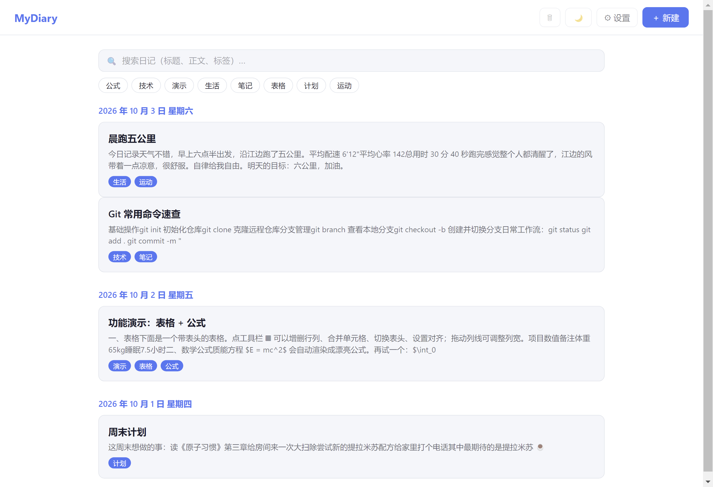
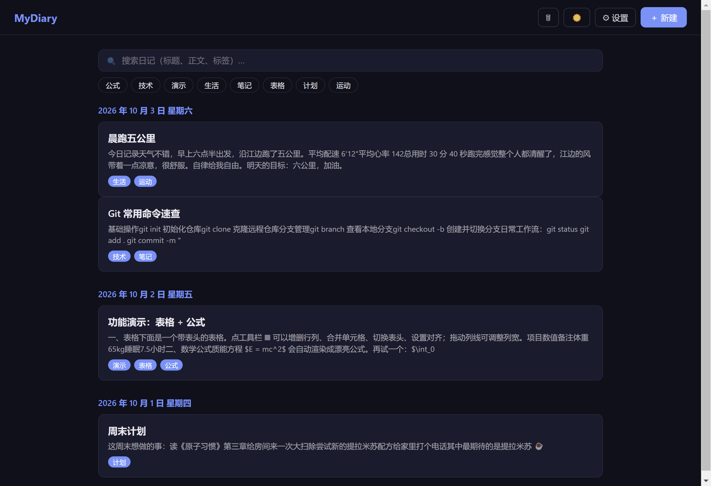
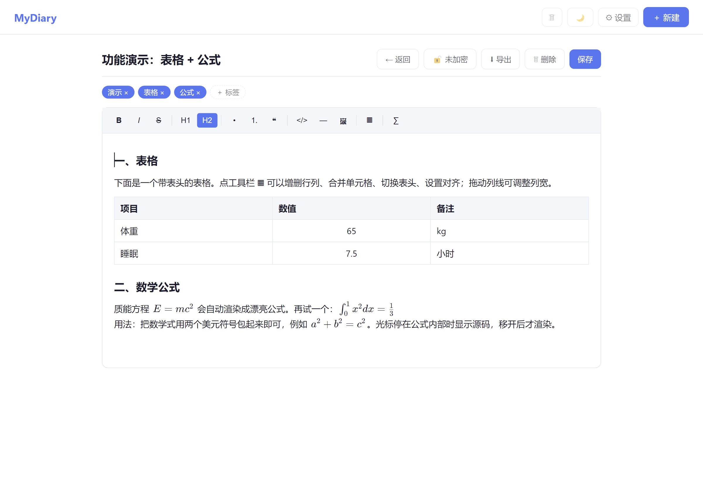
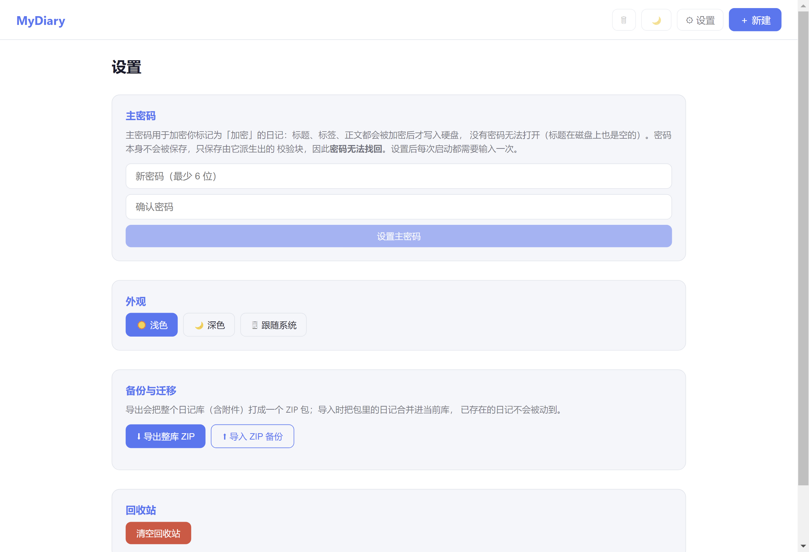

# MyDiary

<p align="center">
  <b>纯本地日记软件 · 无云依赖 · 数据 100% 保存在你自己的电脑上</b>
</p>

---

## 📸 界面预览

| 首页（浅色） | 首页（深色） |
|:---:|:---:|
|  |  |

| 编辑器（表格 + 公式） | 设置页 |
|:---:|:---:|
|  |  |

---

## ✨ 功能特性

- **富文本编辑**：加粗/斜体/删除线/行内代码、多级标题、列表、引用、代码块、水平线
- **表格支持**：可调整列宽，支持表头、增删行列、合并/拆分单元格、单元格对齐
- **数学公式**：行内 LaTeX `$...$`（KaTeX 实时渲染）
- **图片附件**：本地存储，正文引用相对路径
- **标签系统**：自建标签，点标签一键筛选
- **全文搜索**：同时搜索标题、正文、标签
- **主密码加密**：AES-256-GCM + PBKDF2（21 万次迭代），可逐篇标记加密，磁盘上无明文
- **自动保存**：停止输入 2 秒后自动落盘
- **回收站**：删除进回收站，30 天内可恢复
- **备份迁移**：整库 ZIP 导出/导入，支持回收站一并还原、智能合并
- **主题**：浅色 / 深色 / 跟随系统，顶栏一键切换

---

## 📥 安装

### 方式一：下载安装包（推荐）

打开 [Releases 页面](../../releases/latest)，下载对应平台的安装包：

| 平台 | 安装包 | 用法 |
|---|---|---|
| Windows | `MyDiary Setup *.exe` | 双击安装 |
| macOS | `MyDiary-*.dmg` | 打开后把图标拖入「应用程序」 |
| Linux | `MyDiary-*.AppImage` | `chmod +x` 后直接运行 |

> 安装包**未做代码签名**，Windows SmartScreen 或 macOS Gatekeeper 可能提示「未知发布者」，
> 这是因为没有购买签名证书，属正常现象。Windows 点「更多信息 → 仍要运行」，
> macOS 右键图标选「打开」即可。

### 方式二：从源码运行

适合想看源码、二次开发，或系统没有对应安装包的用户。

**一键安装（推荐）：**

- **Windows**：双击 `setup.bat`，装完双击 `start.bat` 启动
- **macOS / Linux**：

  ```bash
  bash setup.sh   # 安装依赖
  npm start       # 启动应用
  ```

  脚本会自动检测 Node.js：没装会给出对应系统的安装指引。

**手动安装：**

<details>
<summary>展开查看手动步骤</summary>

1. 安装 [Node.js](https://nodejs.org/zh-cn) **18 或更高版本**（含 npm 9+）
2. 克隆或下载本仓库：

   ```bash
   git clone https://github.com/Tiaotiao2014/mydiary.git
   cd mydiary
   ```

3. 安装依赖：

   ```bash
   npm install
   ```

   > 国内网络较慢时，可先切换 npm 镜像：
   > `npm config set registry https://registry.npmmirror.com`

4. 启动：

   ```bash
   npm start
   ```

</details>

### 首次启动

第一次启动会弹出文件夹选择框，**选一个目录作为你的日记库**——之后所有日记、附件、配置都存在这里。这个目录可以随意移动、备份。

不想弹窗也可以用环境变量预先指定：

```bash
MYDIARY_LIBRARY="D:/我的日记库" npm start
```

---

## 📖 使用教程

### 1. 写第一篇日记

1. 首页点右上角 **「＋ 新建」**
2. 输入标题，正文区直接开始写
3. 停止输入 2 秒后**自动保存**（也可以手动点「保存」）
4. 点右上角 **「← 返回」** 回到首页，日记已出现在列表中

### 2. 富文本与表格

编辑器顶部工具栏从左到右：

| 按钮 | 功能 |
|---|---|
| **B** / *I* / ~~S~~ | 加粗 / 斜体 / 删除线 |
| `H1` `H2` | 一级 / 二级标题 |
| 列表图标 | 无序列表、有序列表 |
| `</>` | 代码块 |
| ▦ | **表格**：插入后可增删行列、合并单元格、切换表头、设置对齐；拖动列线调列宽 |
| Σ | 行内**数学公式**：用 `$...$` 包住 LaTeX，如 `$E = mc^2$`，移开光标即渲染 |

### 3. 标签与搜索

- 编辑器顶部点 **「＋ 标签」** 给日记打标签（可多个）
- 首页顶部会聚合显示所有标签，**点标签即筛选**，再点一次取消
- 搜索框支持**全文搜索**：标题、正文、标签同时匹配

### 4. 回收站

- 点日记卡片上的 🗑 删除，日记进入回收站（保留 30 天）
- 顶栏 🗑 图标进入回收站：可**恢复**或**永久删除**

### 5. 主题切换

顶栏 🌙/☀️ 一键在浅色/深色间切换；或到 **设置 → 外观** 选择「跟随系统」。

### 6. 主密码加密（可选但推荐）

用途：把日记**真正加密**存到硬盘，没有密码无法打开——包括标题和标签。

1. **设置 → 主密码**：设置至少 6 位的密码（设置完即处于已解锁状态）
2. **编辑器**：打开某篇日记，点顶部「🔓 未加密」切换为加密（会二次确认）
3. 之后这篇日记的**标题、标签、正文**都会加密后写入硬盘

安全设计一览：

| 项目 | 做法 |
|---|---|
| 密钥派生 | PBKDF2-SHA256，21 万次迭代 + 随机盐 |
| 加密算法 | AES-256-GCM（带完整性校验，密文被篡改会解密失败） |
| 密码存储 | **不保存密码**。磁盘上只有盐、迭代次数、校验块 |
| 会话密钥 | 只在内存中，**应用退出即失效**，下次启动需重新输入 |
| 标题保护 | 标题同样加密，磁盘上 `title` 为空字符串 |

> ⚠️ **忘记密码无法找回**。库中还有加密日记时，解锁页不提供重置（防止日记永久打不开）；
> 若一篇加密日记都没有，则允许重置主密码。
>
> 加密保护的是**硬盘上的文件**；解锁状态下，导出、截图等操作不受保护。

### 7. 备份与迁移

入口：**设置 → 备份与迁移**。

- **导出整库 ZIP**：把整个日记库（含附件、回收站）打包，弹出保存框选择位置（默认文件名带当天日期）
- **导入 ZIP 备份**：选择备份包 → 预览清单（日记数 / 回收站数 / 附件数）→ 选择合并策略 → 确认

合并策略（遇到同 id 日记已存在时）：

| 策略 | 行为 |
|---|---|
| 保留现有的（默认） | 已存在的日记不动，只导入新的 |
| 用备份包覆盖 | 同 id 以备份包版本为准 |

> 导入时**回收站内容一并还原**；附件复用原名不重复占空间；
> 备份包里的 `config.json` **不会**覆盖目标库设置（避免主题、主密码被意外改动）。

### 8. 单篇导出

编辑器里点「导出」，单篇日记可存为 **HTML / Markdown / Excel(CSV)**，位置由你选择。

---

## 🗂 数据存储结构

```
<日记库根目录>/
  config.json          # 全局设置
  diaries/             # 所有日记
    2026-10-01/
      a1b2c3d4/
        diary.json     # 元数据 + Tiptap JSON 正文
  attachments/         # 图片附件（UUID 命名）
  .trash/              # 回收站
```

**换电脑 = 复制这个目录**（或用导出/导入功能）。

---

## ❓ 常见问题

**Q：双击启动闪退 / 白屏？**
用 `start.bat`（Windows）或 `npm start` 启动，不要直接 `electron .`。本机若存在全局变量
`ELECTRON_RUN_AS_NODE=1`，会让 Electron 退化成普通 Node.js 而启动失败——`npm start` 走的
`scripts/start.cjs` 会自动删除该变量。注意**置空或设为 0 都无效**，必须真正删除。

**Q：启动后窗口白屏或闪退（虚拟机/远程桌面常见）？**
多半是 GPU 渲染问题。`electron/main.js` 已默认关闭硬件加速。若你的机器支持且希望开启，
把 `main.js` 顶部的 `app.commandLine.appendSwitch(...)` 注释掉即可。

**Q：忘记主密码了？**
无法找回（见上文安全设计）。若库里还有加密日记，只能永远留着它们；没有加密日记则可重置主密码。

**Q：导出的文件在哪？**
导出都会弹保存框，位置由你选；默认文件名落在系统下载目录。

**Q：数据会上传到云端吗？**
**不会。** 本软件没有任何网络请求，所有数据只存在你选择的日记库目录里。

---

## 🛠 开发

```bash
npm install      # 安装依赖
npm start        # 启动应用（推荐，自动处理环境变量问题）
npm run dev      # 开发模式（Vite 热更新 + Electron）
npm test         # 运行测试
npm run build    # 完整构建（前端 + 安装包，产物在 dist_electron/）
```

技术栈：

| 模块 | 技术 |
|---|---|
| 外壳 | Electron 31 |
| 界面 | Vue 3 + Vite + Pinia |
| 编辑器 | Tiptap（ProseMirror） |
| 公式 | KaTeX |
| 存储 | 本地文件系统（electron-store 配置） |
| 加密 | Web Crypto（AES-256-GCM + PBKDF2） |

---

## 📄 许可证

[MIT](LICENSE)
